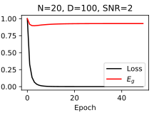
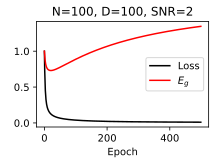
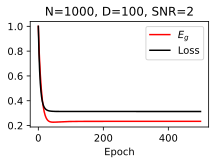
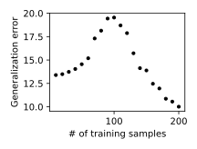

# Double Descent Curve of Linear Regression

This repository reproduces the double descent curve described in Figure 2 in

> Advani, M. S., Saxe, A. M., & Sompolinsky, H. (2020). High-dimensional dynamics of generalization error in neural networks. Neural Networks, 132, 428-446.

## Setup

Let ${\bf x} \in \mathbb R^D$ represent an arbitrary input and let $\{{\bf x}_n, y_n \}_{n=1}^N$ be a supervised learning training set.
The scalar output $y_n$ is generated as

$$y_n = {\bf w}^* \cdot {\bf x}_n + \epsilon_n ,\quad {\bf x}_n \overset{\text{iid}}{\sim} \mathcal N({\bf 0}, {\bf I} / D), \epsilon_n \overset{\text{iid}}{\sim} \mathcal N(0, \sigma^2)$$

We train a linear model $\hat y = {\bf w} \cdot {\bf x}$​ to fit the training set by doing gradient descent on the mean square error loss.

We are interested in the generalization error $E_g$ on novel samples, which is defined as 

$$E_g \equiv \left\langle (y^* - \hat y)^2 \right\rangle\rangle_{{\bf x},\epsilon}=\left\langle ({\bf w}^* \cdot {\bf x} - {\bf w} \cdot {\bf x})^2 \right\rangle_{{\bf x},\epsilon}$$

## Training

Here are three examples of the loss and generalization error curves during training with different number training samples:

|  |  |  |
| ----------------------------- | ------------------------------- | --------------------------------- |

## Double Descent

We train the linear model with different number training samples $N$ and plot the average (across regenerated datasets) generalization error versus $N$​.

Known as the double descent, the generalization error increase with the number of training samples from $1$ to $D$; and decrease with the number of training samples from $D$​​ to infinity.
